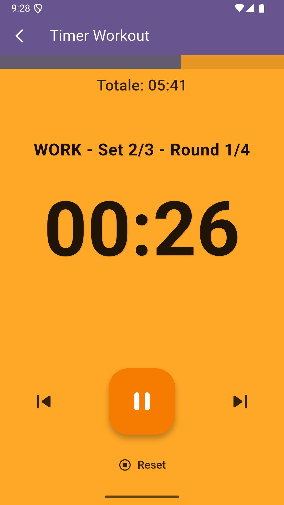

# Flutter Tabata Timer App

A simple yet effective Flutter application for managing Tabata workouts and custom intervals. It allows configuration of preparation time, work time, rest time, number of rounds, number of sets, and rest between sets. Default settings can be saved for quick access.

## ✨ Key Features

* **Configurable Timer:** Set times for:
    * Preparation
    * Work
    * Rest (between rounds)
    * Rest Between Sets
* **Flexible Structure:** Define the number of Rounds per Set and the total number of Sets.
* **Dedicated Timer Screen**:
    * Clear display of remaining time for the current phase.
    * Indication of the current state (Preparing, Work, Rest, Rest Between Sets, Paused, Finished).
    * Visual progress with a total progress bar and dynamic background colors.
    * Intuitive controls.
    * Indication of the current Set and Round.
* **Save Preferences:** Modify and save default timer settings so you don't have to re-enter them every time.
* **Clean Interface:** Based on Material 3 with a Deep Purple theme.

## 📸 Screenshots 

**Workout Setup Screen (Home)**

 

**Timer Running Screen**



## Gets things running

These instructions will get you a copy of the project up and running on your local machine for development and testing purposes.

### Prerequisites

* [Flutter SDK](https://flutter.dev/docs/get-started/install): Ensure you have Flutter installed (verify with `flutter doctor`).
* [Git](https://git-scm.com/): To clone the repository.
* An editor like [VS Code](https://code.visualstudio.com/) or [Android Studio](https://developer.android.com/studio).

### Installation

1.  **Clone the repository:**
    ```bash
    git clone [https://github.com/Pole97/TabataTime.git](https://github.com/Pole97/TabataTime.git)
    ```
    2.  **Navigate into the directory:**
    ```bash
    cd TabataTime 
    ```
    3.  **Install dependencies:**
    ```bash
    flutter pub get
    ```

### Running the App

1.  Make sure an emulator is running or a physical device is connected (`flutter devices`).
2.  Launch the app:
    ```bash
    flutter run
    ```

## 🛠️ Tech Stack

* [Flutter](https://flutter.dev/) - UI Framework.
* [Dart](https://dart.dev/) - Programming Language.
* [shared_preferences](https://pub.dev/packages/shared_preferences) - For saving default timer settings locally.

## 🏗️ Project Structure

The project follows a simple screen-based structure:
```
lib/
|-- main.dart             # Entry point, MaterialApp setup & theme
|-- home_screen.dart      # Screen for setting workout parameters
|-- timer_screen.dart     # Screen displaying and running the timer
|-- settings_screen.dart  # Screen for modifying and saving default values
```

## 🤝 Contributing

Contributions are what make the open-source community such an amazing place to learn, inspire, and create. Any contributions you make are **greatly appreciated**.

If you have a suggestion that would make this better, please fork the repo and create a pull request. You can also simply open an issue with the tag "enhancement".
Don't forget to give the project a star! Thanks again!

1.  Fork the Project
2.  Create your Feature Branch (`git checkout -b feature/AmazingFeature`)
3.  Commit your Changes (`git commit -m 'Add some AmazingFeature'`)
4.  Push to the Branch (`git push origin feature/AmazingFeature`)
5.  Open a Pull Request

## 📄 License

Distributed under the MIT License. See `LICENSE` for more information.
